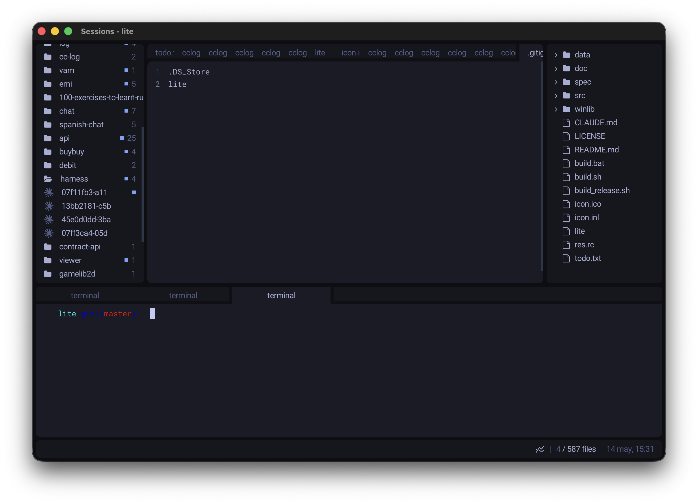

# lite



A fork of [rxi/lite](https://github.com/rxi/lite) — the same tiny Lua-on-SDL2
editor, extended with a few things that make it a comfortable side-by-side
companion for working with coding agents (Claude Code, Codex, Copilot).

## What's added on top of upstream lite

- **cclog sidebar** (`data/plugins/cclog/`) — left-docked viewer for agent
  session logs. Reads `~/.claude/projects/`, Codex, and Copilot transcripts,
  groups them by `cwd`, and opens each session as a tab. Toggle with `F6`
  (or `Ctrl+Shift+E`); refresh with `Shift+F6`.
- **Terminal panel** (`data/plugins/terminal/`) — bottom-docked terminal
  backed by a native PTY (`src/api/pty.c`) and a vendored libvterm
  (`src/lib/vterm/`). Enough fidelity for `vim`, `htop`, `less`. Toggle with
  `` Ctrl+` ``; new tab with `` Ctrl+Shift+` ``. `Cmd+C` / `Cmd+V` copy/paste,
  `Ctrl+C` / `Ctrl+D` / `Ctrl+Z` pass through to the shell.
- **Console plugin** (`data/plugins/console/`) — run shell snippets and
  capture their output into a scrollable view.
- **Image rendering** — `renderer.draw_image` plus `src/api/renderer_image.c`
  and a vendored `stb_image`, used by cclog to draw agent/project icons.
- **Rounded, gapped panel chrome** — `config.gap_size` and
  `config.panel_radius` (live-tunable from `data/user/init.lua`) put a margin
  around the whole window and round the corners of every panel. See
  `data/plugins/panels.lua`.
- **Tokyo Night theme** — bundled at `data/user/colors/tokyonight.lua` and
  enabled by default in `data/user/init.lua`.
- **Status-bar clock** (`data/plugins/clock.lua`).
- **macOS `Cmd` → `Ctrl` remap** (`data/plugins/macos_keys.lua`) so the
  default keymap works with the platform-native modifier.
- **`F5` restarts the editor** in-place (re-execs with the same args).

The core writing principles for this fork are documented in
[CLAUDE.md](CLAUDE.md).

## Building

The project is a small C host plus Lua sources. There's no package manager
and no test suite — just two scripts.

- **Linux / macOS:** `./build.sh` → `./lite`
- **Windows (cross-compile from Linux via MinGW):** `./build.sh windows` →
  `lite.exe` + `res.res`
- **Windows (native, MinGW):** `build.bat`
- **Release bundle (both targets, zipped with SDL2.dll + `data/`):**
  `./build_release.sh`

Both scripts glob every `*.c` under `src/` (including `src/lib/lua52/`,
`src/lib/stb/`, and `src/lib/vterm/`), so new C files don't need any
Makefile updates.

Build-time dependencies: a C11 compiler and `libSDL2` (`-lSDL2 -lm`).
Lua 5.2, stb, and libvterm are vendored.

Lua-only changes do **not** require a rebuild — just relaunch `./lite`.

## Running

```
./lite [path ...]
```

A directory argument becomes the project root; file arguments are opened
as docs. `LITE_SCALE=<n>` overrides the autodetected HiDPI scale.

## Customization

Edit `data/user/init.lua` to tweak config, swap themes, or add keybindings.
Color themes live in `data/user/colors/`. Upstream plugins and themes from
[lite-plugins](https://github.com/rxi/lite-plugins) and
[lite-colors](https://github.com/rxi/lite-colors) generally still work.

## License

MIT — see [LICENSE](LICENSE).
